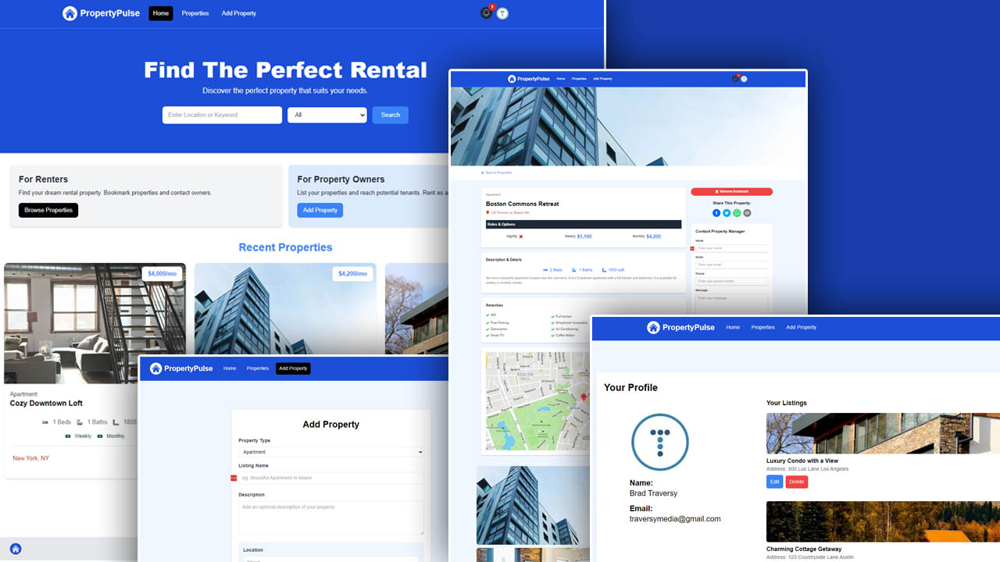

<div align="center">
  <br />
    <a href="#" target="_blank">
      
    </a>
  
  <br />

  <div>
    
    
  </div>

  <h3 align="center">Property Pulse</h3>

   <div align="center">
     A web application to help you find your next rental property
    </div>
</div>

## 📋 <a name="table">Table of Contents</a>

1. 🤖 [Introduction](#introduction)
2. ⚙️ [Tech Stack](#tech-stack)
3. 🔋 [Features](#features)
4. 🤸 [Quick Start](#quick-start)


## <a name="introduction">🤖 Introduction</a>

Built with the latest Next.js version, this web application helps users find their next rental property for stay. 


## <a name="tech-stack">⚙️ Tech Stack</a>

- Next.js
- Tailwind CSS
- NextAuth.js
- MongoDB
- Cloudinary

## <a name="features">🔋 Features</a>

👉 **Authentication**: Implements authentication and authorization features using NextAuth, allowing users to securely log in via gmail

👉 **Property Creation**: Users can create and post properties that they want to rent out.

👉 **Internal Messaging System**: Users can send messages to property owners

👉 **Bookmarking/Saving**: Users can bookmark/save properties that they like.

👉 **Responsive Design**: Follows responsive design principles to ensure optimal user experience across devices, adapting seamlessly to different screen sizes and resolutions.

and many more, including code architecture and reusability.

## <a name="quick-start">🤸 Quick Start</a>

Follow these steps to set up the project locally on your machine.

**Prerequisites**

Make sure you have the following installed on your machine:

- [Git](https://git-scm.com/)
- [Node.js](https://nodejs.org/en)
- [npm](https://www.npmjs.com/) (Node Package Manager)

**Cloning the Repository**

```bash
git clone https://github.com/Damjan15/PropertyPulse
cd property-pulse
```

**Installation**

Install the project dependencies using npm:

```bash
npm install
```

**Set Up Environment Variables**

Create a new file named `.env` in the root of your project and add the following content:

```env
MONGODB_URI=
CLERK_SECRET_KEY=
GOOGLE_CLIENT_ID=
GOOGLE_CLIENT_SECRET=
NEXTAUTH_SECRET=
CLOUDINARY_CLOUD_NAME=
CLOUDINARY_API_KEY=
CLOUDINARY_API_SECRET=
```


**Running the Project**

```bash
npm run dev
```

Open [http://localhost:3000](http://localhost:3000) in your browser to view the project.

